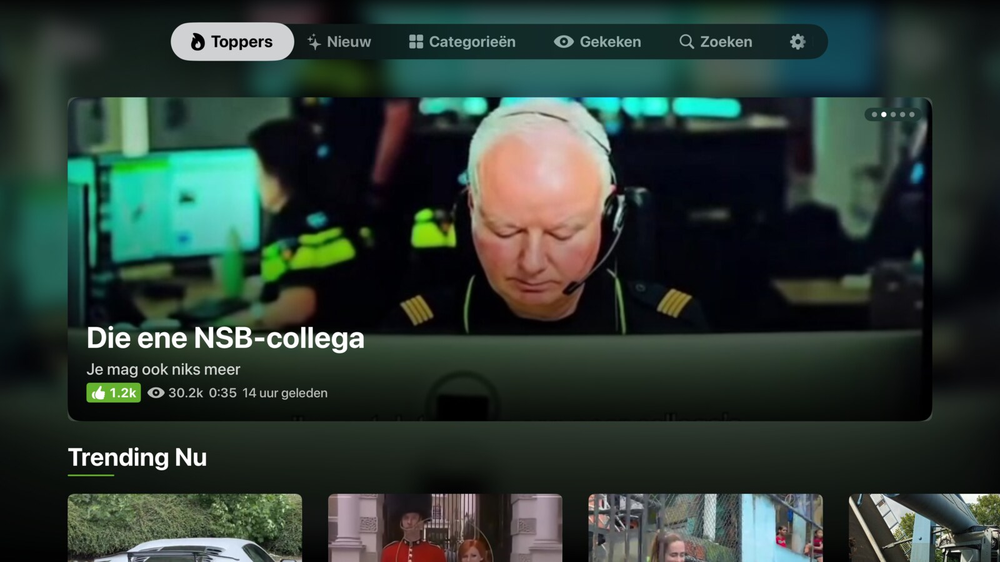
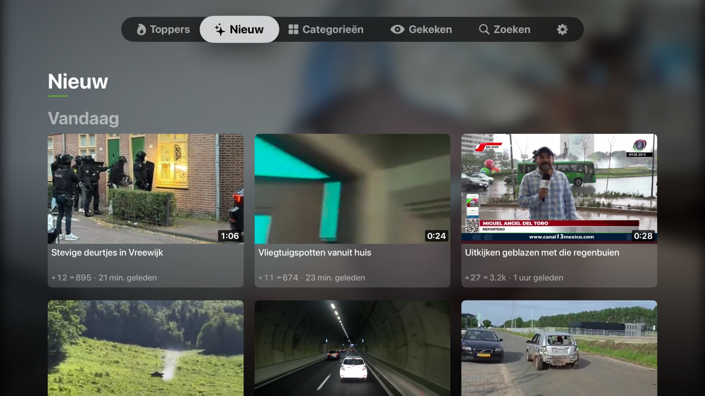
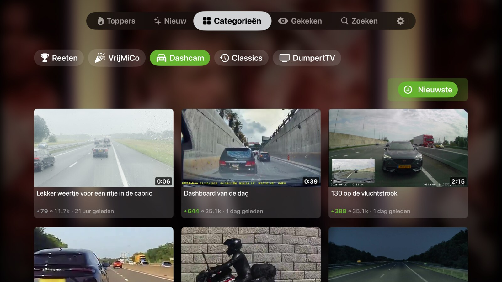
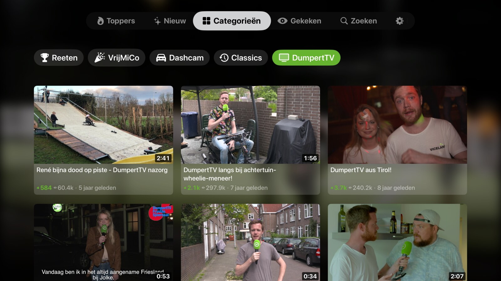
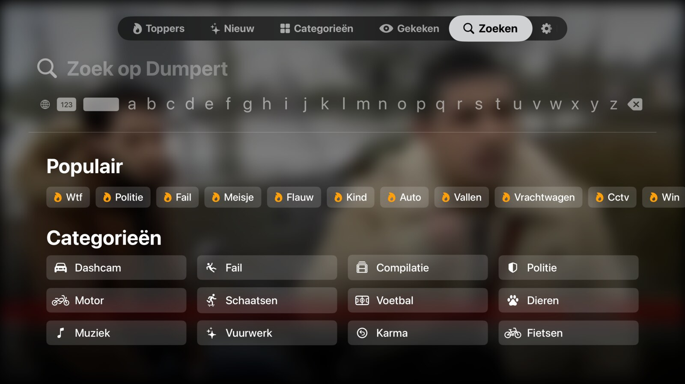
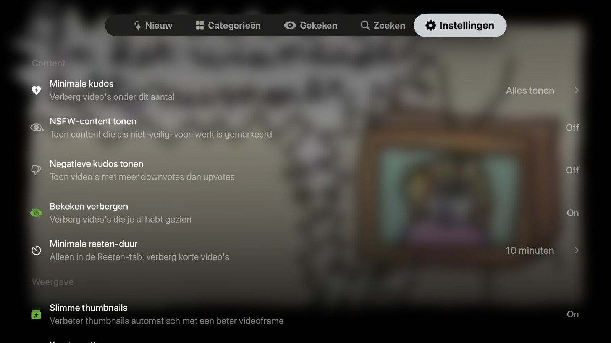

<p align="center">
  
</p>

# DumpertTV

<p align="center">
  <a href="https://testflight.apple.com/join/TXTUMzEq"></a>
  
  
  
  <a href="https://github.com/rm335/dumpert-apple-tv/blob/main/LICENSE"></a>
  <a href="https://github.com/rm335/dumpert-apple-tv/stargazers"></a>
  <a href="https://github.com/rm335/dumpert-apple-tv/commits/main"></a>
  
  
</p>

**DumpertTV** is an unofficial [Dumpert](https://www.dumpert.nl) app for **Apple TV** — a native **tvOS** client built with **Swift 6** and **SwiftUI** that lets you browse, search and stream Dumpert videos on the big screen. Watch Toppers, Nieuw and the Classics, with Top Shelf integration, CloudKit sync across your Apple TVs, and SharePlay for watching together. Free public TestFlight beta below.

> **Disclaimer**
>
> **This project is not affiliated with, endorsed by, or associated with Dumpert or DPG Media B.V.**
> Dumpert is a registered trademark of DPG Media B.V. All trademarks belong to their respective owners.
> This app consumes the public Dumpert API. Use at your own risk.

---

## Installation via TestFlight

<p align="center">
  
</p>

<p align="center">
  <a href="https://testflight.apple.com/join/TXTUMzEq">
    
  </a>
</p>

The easiest way to install DumpertTV on your Apple TV:

1. Install **TestFlight** from the App Store on your Apple TV and iPhone
2. Open the [TestFlight invite link](https://testflight.apple.com/join/TXTUMzEq) on your iPhone and accept the invite
3. Open **TestFlight** on your Apple TV and install the app

---

## Features

### Content Browsing
- **6 top-level tabs** (Dutch UI labels): Toppers (Top), Nieuw (New), Categorieën (Categories), Gekeken (Watched), Zoeken (Search), Instellingen (Settings)
- The **Categorieën** tab consolidates Reeten, VrijMiCo, Dashcam, Classics and DumpertTV behind an in-view pill filter (selection persists via `@SceneStorage`)
- **Hero banner** with horizontally scrolling carousel and face-centered thumbnails
- **Infinite scroll pagination** on category and classics views
- **Skeleton loading** with shimmer animation while content loads
- **Top Shelf extension** showing trending content directly on the Apple TV home screen (honors the NSFW setting)
- **Immersive background** with dynamic blurred imagery
- **Loading screen** with logo animation and a random sound effect (NSFW sounds are withheld when NSFW content is hidden)
- **Sort order** support for category tabs and search results
- **Context menu** on video cards (long press)

### Video Player
- Full-screen video playback via `AVPlayerViewController`
- **Autoplay** with configurable up-next overlay and countdown timer
- **Next video preloading** for seamless playback
- **Playback speed** control (0.5x, 0.75x, 1x, 1.25x, 1.5x, 2x)
- **Watch progress tracking** with throttled saves (5-second intervals)
- **Resume overlay** when returning to a previously watched video
- **Top comment overlay** showing popular comments during playback
- **Now Playing** info on the Lock Screen and Control Center
- **Swipe gestures** on the Siri Remote to skip to previous/next video
- Watched badge indicator on already-viewed content

### Watched Items
- **Gekeken** (Watched) sub-tab under Categories, showing previously watched videos
- Track and manage watch history

### SharePlay
- **Watch Together** via SharePlay (GroupActivities)
- Synchronized playback across multiple Apple TVs
- Participant count indicator

### Photo Viewer
- Full-screen photo display with zoom controls
- Overlay with metadata (title, date, kudos)

### Search
- Full-text search with the Dumpert API
- **Filters**: media type, time period, minimum kudos, duration
- **Sort order**: relevance, date, kudos
- **Popular tags** and recent search suggestions
- **In-memory result caching** (5-minute TTL)
- Search history persistence

### Sync & Offline
- **CloudKit sync** for watch progress, settings, curation entries, and search history across Apple TV devices
- **Delta sync** with change tokens for efficient updates
- **Offline support** with network monitoring banner
- **ETag-based HTTP caching** (304 Not Modified) for API responses
- **Retry logic** with exponential backoff (3 attempts, 2^n second delays) on 5xx and network errors

### Localization
- Dutch (nl) and English (en) via String Catalogs
- All user-facing strings use `String(localized:comment:)` for translator context

### Accessibility
- **VoiceOver** labels throughout all views
- Adjustable action on hero carousel for screen reader users

### Deep Linking
- URL scheme: `dumpert://video/{id}`
- Used by the Top Shelf extension to open videos directly

---

## Screenshots

| Toppers | Nieuw |
|:---:|:---:|
|  |  |
| **Categorieën** | **DumpertTV** |
|  |  |
| **Zoeken** | **Instellingen** |
|  |  |

---

## Requirements

| Requirement | Version |
|---|---|
| Xcode | 26.3+ |
| tvOS deployment target | 18.0+ |
| Swift | 6.0 (strict concurrency) |
| [XcodeGen](https://github.com/yonaskolb/XcodeGen) | Latest |
| Apple Developer account | Required for CloudKit and code signing |

---

## Getting Started

### 1. Install XcodeGen

```bash
brew install xcodegen
```

### 2. Clone the repository

```bash
git clone https://github.com/rm335/dumpert-apple-tv.git
cd dumpert-apple-tv
```

### 3. Generate the Xcode project

```bash
xcodegen generate
```

> The `.xcodeproj` is generated from `project.yml` — never edit it directly.

### 4. Open in Xcode

```bash
open Dumpert.xcodeproj
```

### 5. Configure signing

- Select your development team for both the **Dumpert** and **DumpertTopShelf** targets.
- Change the bundle identifiers if needed (default: `nl.dumpert.tvos`).

### 6. Configure CloudKit (optional)

CloudKit sync is optional. If you want cross-device sync:

1. Update `Dumpert/Dumpert.entitlements` with your own iCloud container identifier.
2. Update `DumpertTopShelf/DumpertTopShelf.entitlements` with your own app group.
3. Create the corresponding CloudKit container in the [Apple Developer portal](https://developer.apple.com/account/).

> Without CloudKit, the app works fully with local-only persistence.

### 7. Build and run

Build and run on an Apple TV or the tvOS Simulator.

---

## Architecture

### Overview

```
┌──────────────────────────────────────────────────────────────┐
│                        DumpertApp                            │
│                   (SwiftUI @main entry)                      │
│                                                              │
│  ┌────────────────────────────────────────────────────────┐  │
│  │  LoadingScreenView → ContentView (TabView, 5 tabs)     │  │
│  │  Toppers │ Nieuw │ Categorieën │ Zoeken │ Instellingen │  │
│  └──────────────────────┬─────────────────────────────────┘  │
│                         │                                    │
│                 @Environment                                 │
│                         │                                    │
│  ┌──────────────────────▼─────────────────────────────────┐  │
│  │            VideoRepository                              │  │
│  │      @Observable @MainActor                             │  │
│  │      Single source of truth                             │  │
│  └───┬──────────┬──────────┬──────────┬───────────────────┘  │
│      │          │          │          │                       │
│  ┌───▼───┐ ┌───▼────┐ ┌───▼───────┐ ┌▼──────────────┐       │
│  │ API   │ │ Cache  │ │ CloudKit  │ │ NowPlaying /  │       │
│  │ Client│ │ Service│ │ Service   │ │ SharePlay     │       │
│  │(actor)│ │(actor) │ │ (actor)   │ │ (@Observable) │       │
│  └───────┘ └────────┘ └───────────┘ └───────────────┘       │
└──────────────────────────────────────────────────────────────┘
```

### Key Patterns

| Pattern | Usage |
|---|---|
| `@Observable` + `@MainActor` | `VideoRepository`, `NetworkMonitor`, `UserSettings`, `SharePlayService`, `ImmersiveBackgroundState` — reactive state on main thread |
| Actor isolation | `DumpertAPIClient`, `CacheService`, `CloudKitService`, `ImageCacheService` — thread-safe services |
| Environment injection | `VideoRepository`, `NetworkMonitor`, `ImmersiveBackgroundState`, `LoadingSoundPlayer` injected via `.environment()` |
| Protocol-based DI | `APIClientProtocol`, `CacheServiceProtocol` for testability |
| Swift 6 strict concurrency | `SWIFT_STRICT_CONCURRENCY: complete` across all targets |

### Data Flow

```
Dumpert API → DumpertItem (API model) → MediaItem (domain enum) → Video / Photo
                                              │
                                         VideoRepository
                                              │
                                    SwiftUI views via @Environment
```

---

## Project Structure

```
dumpert/
├── project.yml                     # XcodeGen project configuration
├── Dumpert/                        # Main app target
│   ├── App/
│   │   ├── DumpertApp.swift        # @main entry, environment setup, deep linking
│   │   └── ContentView.swift       # Root TabView with 5 tabs + offline banner
│   ├── Models/
│   │   ├── API/                    # Codable API response models
│   │   │   ├── DumpertAPIResponse.swift
│   │   │   ├── DumpertItem.swift
│   │   │   ├── DumpertMedia.swift
│   │   │   ├── DumpertStats.swift
│   │   │   └── DumpertComment.swift
│   │   └── Domain/                 # App domain models
│   │       ├── Video.swift
│   │       ├── Photo.swift
│   │       ├── MediaItem.swift     # enum: .video(Video) | .photo(Photo)
│   │       ├── VideoCategory.swift
│   │       ├── UserSettings.swift
│   │       ├── WatchProgress.swift
│   │       ├── SearchFilter.swift
│   │       ├── SortOrder.swift
│   │       ├── CurationEntry.swift
│   │       ├── SearchHistoryEntry.swift
│   │       └── WatchTogetherActivity.swift  # GroupActivities for SharePlay
│   ├── Networking/
│   │   ├── DumpertAPIClient.swift  # Actor with ETag + retry
│   │   ├── APIClientProtocol.swift # Protocol for mocking
│   │   ├── APIEndpoint.swift       # URL routing
│   │   └── APIError.swift          # Error types
│   ├── Services/
│   │   ├── VideoRepository.swift   # @Observable source of truth
│   │   ├── CacheService.swift      # Disk cache (50MB LRU)
│   │   ├── CacheServiceProtocol.swift
│   │   ├── CloudKitService.swift   # iCloud delta sync
│   │   ├── CategoryService.swift   # Category filtering
│   │   ├── ImageCacheService.swift # Two-layer image cache (80MB mem + 200MB disk)
│   │   ├── ImagePrefetchService.swift
│   │   ├── NetworkMonitor.swift    # NWPathMonitor connectivity
│   │   ├── FaceDetectionService.swift
│   │   ├── RefreshScheduler.swift
│   │   ├── SharePlayService.swift  # GroupActivities coordination
│   │   ├── NowPlayingService.swift # MPNowPlayingInfoCenter + remote commands
│   │   ├── LoadingSoundPlayer.swift  # Random startup sound (NSFW-filtered)
│   │   ├── LoadingSoundCatalog.swift # Sounds.json manifest → NSFW classification
│   │   ├── ImmersiveBackgroundState.swift
│   │   ├── ThumbnailUpgradeService.swift
│   │   └── ThumbnailUpgradeDiskCache.swift
│   ├── ViewModels/
│   │   ├── VideoPlayerViewModel.swift
│   │   └── SearchViewModel.swift
│   ├── Views/
│   │   ├── Components/             # Reusable UI components
│   │   │   ├── VideoCardView.swift
│   │   │   ├── VideoPreviewView.swift
│   │   │   ├── VideoContextMenu.swift
│   │   │   ├── FaceCenteredThumbnailView.swift
│   │   │   ├── FocusableCapsuleButtonStyle.swift
│   │   │   ├── ImmersiveBackgroundView.swift
│   │   │   ├── SectionTitleView.swift
│   │   │   ├── KudosBadgeView.swift
│   │   │   ├── WatchedBadgeView.swift
│   │   │   ├── EmptyStateView.swift
│   │   │   ├── SkeletonView.swift
│   │   │   ├── ToastView.swift
│   │   │   └── AutoDismissModifier.swift
│   │   ├── LoadingScreen/
│   │   │   └── LoadingScreenView.swift  # Netflix-style loading with logo animation
│   │   ├── Player/
│   │   │   ├── VideoPlayerView.swift
│   │   │   ├── UpNextOverlayView.swift
│   │   │   ├── ResumeOverlayView.swift
│   │   │   ├── TopCommentOverlayView.swift
│   │   │   ├── NowPlayingOverlayView.swift
│   │   │   ├── SharePlayIndicatorView.swift
│   │   │   ├── FullScreenImageView.swift
│   │   │   ├── FullScreenImageOverlay.swift
│   │   │   └── ZoomControlsView.swift
│   │   ├── Search/
│   │   │   ├── SearchView.swift
│   │   │   ├── SearchSuggestionsView.swift
│   │   │   └── SearchFilterBar.swift
│   │   ├── Sections/
│   │   │   ├── ToppersSectionView.swift
│   │   │   ├── CategoriesSectionView.swift  # Pill-bar container for Reeten/VrijMiCo/Dashcam/Classics/Gekeken
│   │   │   ├── CategorySectionView.swift
│   │   │   ├── ClassicsSectionView.swift
│   │   │   └── WatchedSectionView.swift
│   │   └── Settings/
│   │       ├── SettingsView.swift
│   │       ├── SettingsComponents.swift
│   │       ├── SettingsPickerDestination.swift
│   │       └── UpNextSettingsView.swift
│   ├── Extensions/
│   │   ├── String+HTML.swift       # HTML tag/entity stripping
│   │   ├── Color+Dumpert.swift     # Brand colors (#65B32E)
│   │   └── Date+Formatting.swift
│   ├── Utilities/
│   │   ├── AppLogger.swift         # os.Logger categories
│   │   ├── DurationFormatter.swift # MM:SS formatting
│   │   └── MediaItem+Present.swift
│   ├── Assets.xcassets/
│   ├── Dumpert.entitlements
│   └── Info.plist
├── DumpertTopShelf/                # Top Shelf extension
│   ├── ContentProvider.swift       # TVTopShelfContentProvider
│   ├── DumpertTopShelf.entitlements
│   └── Info.plist
├── Shared/                         # Shared between app + extension
│   ├── TopShelfItem.swift
│   ├── TopShelfDataStore.swift     # App Group UserDefaults
│   └── TopShelfFetcher.swift
├── DumpertTests/                   # Unit tests (122 tests, 15 suites)
│   ├── ModelTests.swift
│   ├── APIDecodingTests.swift
│   ├── DumpertDateTests.swift
│   ├── DayGroupingTests.swift
│   ├── DurationFormatterTests.swift
│   ├── SearchFilterTests.swift
│   ├── SearchViewModelTests.swift
│   ├── CategoryServiceTests.swift
│   ├── CacheServiceTests.swift
│   ├── CloudKitMergeTests.swift
│   ├── CloudKitSettingsSyncTests.swift
│   ├── UserSettingsPersistenceTests.swift
│   ├── LoadingSoundCatalogTests.swift
│   ├── ErrorCaseTests.swift
│   ├── AutoNextPlayTests.swift
│   └── Fixtures/                   # JSON test fixtures
│       ├── hotshiz.json
│       ├── latest.json
│       ├── search_reeten.json
│       └── foto_item.json
└── LICENSE
```

---

## API

The app uses the public Dumpert mobile API.

| Endpoint | Description |
|---|---|
| `GET /hotshiz` | Currently trending items |
| `GET /top5/week/{date}` | Top items of the week |
| `GET /top5/maand/{date}` | Top items of the month |
| `GET /latest/{page}` | Latest items (paginated) |
| `GET /search/{query}/{page}?order=` | Search results (paginated, optional sort order) |
| `GET /info/{id}` | Single item details |
| `GET /classics/{page}` | Classic items (paginated) |
| `GET /related/{id}` | Related items for a given video |

Base URL: `https://post.dumpert.nl/api/v1.0`

---

## Targets

The project has 3 targets, defined in `project.yml`:

| Target | Type | Bundle ID | Description |
|---|---|---|---|
| **Dumpert** | tvOS Application | `nl.dumpert.tvos` | Main app |
| **DumpertTopShelf** | App Extension | `nl.dumpert.tvos.topshelf` | Top Shelf content provider |
| **DumpertTests** | Unit Test Bundle | `nl.dumpert.tvos.tests` | 122 tests across 15 suites |

---

## Tests

122 tests across 15 suites, using Swift Testing framework:

| Suite | Tests | What it covers |
|---|---|---|
| **ModelTests** | 9 | WatchProgress, CurationEntry, UserSettings, VideoCategory, HTML stripping |
| **APIDecodingTests** | 18 | API response decoding, Video conversion, HLS preference, tags parsing |
| **DumpertDateTests** | 9 | ISO8601 parsing — fractional seconds, mixed formats, Europe/Amsterdam boundaries |
| **DayGroupingTests** | 5 | Grouping the Nieuw feed into Europe/Amsterdam day buckets |
| **DurationFormatterTests** | 10 | Time formatting (MM:SS, edge cases) |
| **SearchFilterTests** | 5 | Filter activation for media type, period, kudos, duration |
| **SearchViewModelTests** | 12 | Search state, debouncing, pagination, cancellation, history persistence |
| **CategoryServiceTests** | 7 | Category → endpoint routing, sort order, curation flags |
| **CacheServiceTests** | 6 | Persistence of watch progress, settings, curation, search history |
| **CloudKitMergeTests** | 4 | Remote/local merge logic, deletion handling, change-token persistence |
| **CloudKitSettingsSyncTests** | 5 | Settings sync without overwriting local values |
| **UserSettingsPersistenceTests** | 4 | Settings round-trip, defaults, migration |
| **LoadingSoundCatalogTests** | 7 | NSFW classification of startup sounds (safe-by-default allowlist) + shipped manifest |
| **ErrorCaseTests** | 5 | API error descriptions, network/decoding/HTTP error handling, 5xx retry |
| **AutoNextPlayTests** | 16 | Playlist navigation, autoplay state, skip/previous, up-next overlay |

### Running Tests

```bash
# Generate project and run tests
xcodegen generate && xcodebuild test \
  -scheme Dumpert \
  -destination 'platform=tvOS Simulator,name=Apple TV' \
  -resultBundlePath TestResults
```

---

## Tech Stack

| Technology | Usage |
|---|---|
| **Swift 6.0** | Strict concurrency (`complete` mode) |
| **SwiftUI** | All UI, tvOS-native |
| **AVKit** | Video playback via `AVPlayerViewController` |
| **GroupActivities** | SharePlay / Watch Together |
| **MediaPlayer** | Now Playing info + remote command handling |
| **CloudKit** | Cross-device sync (private database, custom zone) |
| **Network.framework** | `NWPathMonitor` for connectivity |
| **Vision.framework** | Face detection for thumbnail centering |
| **os.log** | Structured logging (`.cloudKit`, `.cache`, `.network`) |
| **String Catalogs** | Localization (Dutch + English) |
| **XcodeGen** | Project generation from `project.yml` |
| **Swift Testing** | Unit test framework |

---

## Configuration

### Settings (in-app)

The Settings tab allows users to configure:

**Display & Content:**
- Minimum kudos filter (0–500+)
- NSFW content toggle (also withholds NSFW startup sounds and Top Shelf items)
- Negative kudos toggle
- Hide watched content
- Smart thumbnails (automatic thumbnail upgrade)
- Tile size (small, normal, large)

**Playback:**
- Autoplay on/off
- Video preview on focus
- Up-next overlay, countdown, and minimum video length
- Top comment overlay mode (off, single, all) with reading speed
- Swipe-to-skip on Siri Remote
- Resume overlay
- Minimum Reeten duration filter

**Data & Storage:**
- Manual refresh
- Clear cache, watch history, search history
- Reset to defaults

Settings are persisted locally and synced via CloudKit.

### Entitlements

| Entitlement | Target | Purpose |
|---|---|---|
| iCloud containers | Dumpert | CloudKit sync |
| CloudKit | Dumpert | iCloud database access |
| KV store | Dumpert | Key-value sync |
| App Groups | Both | Share data between app and Top Shelf extension |

---

## Contributing

Contributions are welcome! Here's how:

1. Fork the repository
2. Create a feature branch: `git checkout -b feature/my-feature`
3. Install XcodeGen: `brew install xcodegen`
4. Generate the project: `xcodegen generate`
5. Make your changes
6. Run the tests to make sure everything passes
7. Commit your changes with a clear message
8. Push to your fork and open a Pull Request

### Guidelines

- Run `xcodegen generate` after changing `project.yml`
- Never commit `Dumpert.xcodeproj` changes directly — edit `project.yml` instead
- Maintain Swift 6 strict concurrency compliance
- Add tests for new functionality
- Use actors for new services, `@Observable @MainActor` for new state holders
- Follow existing patterns for file organization

---

## License

This project is licensed under the MIT License — see the [LICENSE](LICENSE) file for details.

---

## Acknowledgements

- [Dumpert](https://www.dumpert.nl) for the public API
- [XcodeGen](https://github.com/yonaskolb/XcodeGen) for declarative Xcode project management
